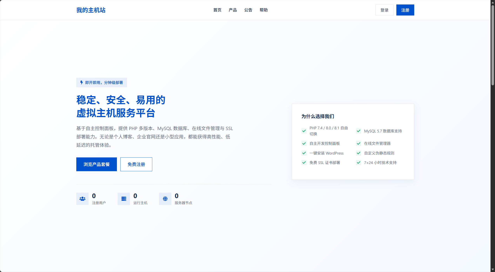
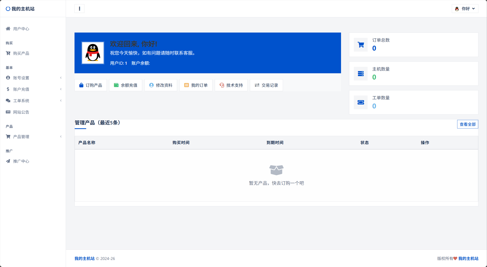

# MNBT-SALE 系统部署指南

本项目是一个基于ThinkPHP框架开发的主机销售管理系统。为了正确运行该项目，请按照以下步骤进行配置。

<p align="center">
  <a href="LICENSE"></a>
  
  
  
  
  
  
</p>

## 目录结构

```
.
├── app                 应用目录
│   ├── admin           后台管理模块
│   ├── index           前台展示模块
│   ├── install         安装向导模块
│   └── ...             其他配置文件
├── extend              扩展目录
│   ├── PHPMailer       邮件发送组件
│   └── pay             支付相关组件
├── frame               ThinkPHP框架核心目录
├── plugins             插件目录
├── public              网站根目录（Web服务器应指向此目录）
│   ├── static          静态资源目录
│   └── index.php       入口文件
└── runtime             运行时目录
```

## 运行环境要求

- PHP 7.2 或更高版本
- MySQL 5.7 或更高版本
- Apache 或 Nginx 服务器
- PHP 扩展：pdo_mysql、curl、gd、openssl

## 部署步骤

如果你使用宝塔面板进行部署，可以参考更直观的 [宝塔面板安装教程](btpanel_install/宝塔面板安装教程.md)。

### 1. 设置运行目录

将Web服务器的运行目录设置为 `public` 目录。这是为了安全考虑，确保应用代码不被直接访问。

#### Apache 配置示例：
在虚拟主机配置中设置：
```apache
DocumentRoot "path/to/project/public"
<Directory "path/to/project/public">
    AllowOverride All
    Require all granted
</Directory>
```

#### Nginx 配置示例：
```nginx
server {
    listen 80;
    server_name yourdomain.com;
    root /path/to/project/public;
    index index.php index.html;

    location / {
        try_files $uri $uri/ /index.php?$query_string;
    }

    location ~ \.php$ {
        # PHP-FPM 配置
    }
}
```

### 2. 配置伪静态规则

系统使用ThinkPHP的路由功能，需要配置伪静态规则来实现URL重写。

#### Apache环境：
确保 `public/.htaccess` 文件包含以下内容：
```apache
<IfModule mod_rewrite.c>
  Options +FollowSymlinks -Multiviews
  RewriteEngine On

  RewriteCond %{REQUEST_FILENAME} !-d
  RewriteCond %{REQUEST_FILENAME} !-f
  RewriteRule ^(.*)$ index.php/$1 [QSA,PT,L]
</IfModule>
```

#### Nginx环境：
在server块中添加以下重写规则：
```nginx
location / {
    if (!-e $request_filename) {
       rewrite  ^(.*)$  /index.php?s=$1  last;
       break;
    }
}
```

### 3. 运行安装向导

首次访问系统时，如果未检测到安装锁文件（`install.lock`），系统会自动跳转到安装向导页面。按照向导提示完成以下步骤：

1. **许可协议** - 阅读并同意许可协议
2. **环境检测** - 系统自动检测服务器环境是否满足要求
3. **数据库配置** - 填写MySQL数据库连接信息（如果数据库不存在将自动创建）
4. **管理员设置** - 设置网站名称、管理员账号和密码

安装完成后，系统会在根目录生成 `install.lock` 文件，防止重复安装。

> 如果需要重新安装，请删除 `install.lock` 文件即可重新进入安装向导。

### 4. 访问系统

完成安装后，通过浏览器访问您的域名：

- 前台地址：http://yourdomain.com
- 后台地址：http://yourdomain.com/admin

## 更新教程

当项目发布新版本时，可按照以下步骤进行升级：

1. **备份数据**
   - 通过宝塔面板或 phpMyAdmin 导出完整数据库。
   - 备份整个网站目录，重点保留 `app/database.php`、`app/config.php`、自定义静态资源以及 `install.lock` 文件。

2. **下载新版源码**
   - 从项目仓库下载最新版本的源码压缩包。

3. **覆盖文件**
   - 暂停站点访问或设置维护页面。
   - 将新版源码上传到服务器并解压，覆盖旧版程序文件。
   - **不要覆盖** `app/database.php`、`app/config.php`、`runtime/` 目录和 `install.lock` 文件，除非你确认需要同步官方默认配置。

4. **执行数据库升级脚本（如有）**
   - 如果新版本提供了 `update.sql` 等数据库升级文件，请在 phpMyAdmin 或宝塔数据库工具中执行该脚本。

5. **清理缓存**
   - 删除 `runtime/` 目录下的缓存文件，使新配置生效。

6. **验证升级结果**
   - 重新开启站点，访问前台和后台，检查功能是否正常。
   - 如发现异常，及时回滚到备份版本。

> 不同版本的更新内容可能不同，升级前请务必查看对应版本的更新说明，并按说明操作。

## 常见问题

1. **页面显示空白或500错误**
   - 检查PHP版本是否符合要求
   - 确认runtime目录是否有写入权限
   - 检查Web服务器是否正确指向public目录

2. **页面样式丢失**
   - 检查Web服务器是否正确设置了运行目录为public
   - 确保public/static目录中的静态资源可以正常访问

3. **数据库连接失败**
   - 检查[database.php](app/database.php)配置文件中的数据库连接信息
   - 确认MySQL服务是否正常运行
   - 检查数据库用户是否有足够的权限

4. **安装向导无法访问**
   - 确保已正确配置伪静态规则
   - 检查 `app/database.php` 和 `runtime` 目录是否有写入权限

## 安全建议

1. 部署完成后，建议将 [app/config.php](/app/config.php) 中的 `app_debug` 设置为 `false`
2. 确保public目录外的其他文件无法通过Web访问
3. 定期备份数据库和重要文件
4. 安装完成后建议删除 `app/install` 目录，或确保 `install.lock` 文件存在
5. 首次登录后请立即修改管理员密码

## 界面预览

### 前台首页



### 用户中心



## 声明

本项目中部分代码来源于 sib.cc 思博系统（SIB-HOST），在此对原作者表示感谢。